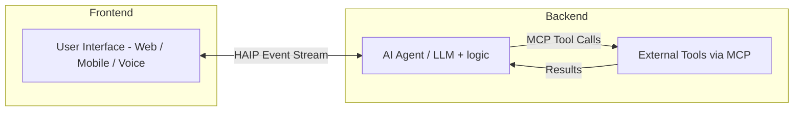
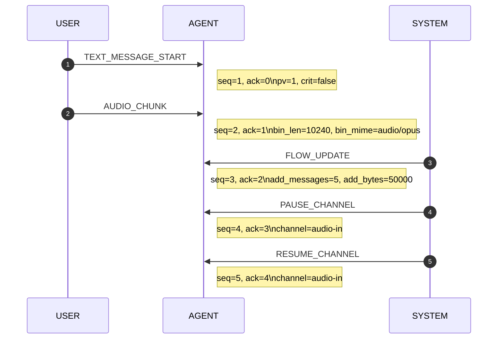

# Human‑Agent Interaction Protocol (HAIP)

## Documation

* [Documetation](https://haiprotocol.com/)

## Introduction

The Human‑Agent Interaction Protocol (HAIP) is an open standard designed to streamline real‑time, multi‑modal exchanges between user‑facing web, mobile, and voice applications and AI agents. It complements the Model Context Protocol (MCP): HAIP focuses on the human‑agent layer, acting as a universal translator between front‑end interfaces and intelligent back‑ends, while MCP governs tool execution. HAIP is transport‑agnostic: it runs over WebSockets, Server‑Sent Events (SSE), HTTP streaming, or any message bus.

## Goals and Key Features

- **Multi‑modal interaction (text and voice):** native support for text chat and audio streams.
- **Asynchronous and long‑running tool calls:** non‑blocking agent workflows with progress updates.
- **Robust streaming:** low‑latency chunk delivery with reconnection and de‑duplication.
- **Flexible event sequencing:** tolerant of out‑of‑order or overlapping events.
- **Simplified tool integration:** dynamic advertisement of tools and schemas.
- **Transport‑agnostic design:** works over SSE, WebSocket, HTTP or message buses.
- **Framework‑agnostic front‑ends:** React, Vue, Angular, native mobile or any.
- **Seamless MCP compatibility:** HAIP for interaction; MCP for tool execution.

## Architecture Overview



## Versioning and Extensibility

### Semantic Version Triplet

HAIP uses **MAJOR.MINOR.PATCH**:

- **MAJOR:** incompatible changes.
- **MINOR:** backwards‑compatible additions (new event, new optional field).
- **PATCH:** editorial or bug‑fix, no structural impact.

### HAIP Handshake Requirements

Each side’s initial `HAI` payload **MUST** include:

```json
{
  "type": "HAI",
  "payload": {
    "haip_version": "1.1.2",
    "accept_major": [1],
    "accept_events": [
      "HAI","RUN_STARTED","RUN_FINISHED","RUN_CANCEL","RUN_ERROR",
      "PING","PONG","REPLAY_REQUEST",
      "TEXT_MESSAGE_START","TEXT_MESSAGE_PART","TEXT_MESSAGE_END",
      "AUDIO_CHUNK",
      "TOOL_CALL","TOOL_UPDATE","TOOL_DONE","TOOL_CANCEL",
      "TOOL_LIST","TOOL_SCHEMA",
      "ERROR","FLOW_UPDATE","PAUSE_CHANNEL","RESUME_CHANNEL"
    ],
    "capabilities": {
      "binary_frames": true,
      "flow_control": {
        "initial_credit_messages": 32,
        "initial_credit_bytes": 262144
      }
    },
    "last_rx_seq": "42"
  }
}

```

- `haip_version`: highest version the sender implements.
- `accept_major`: list of MAJOR versions it can parse.
- `accept_events`: explicit whitelist of event types; omit to exclude.
- `capabilities`: optional feature flags. `binary_frames` advertises two‑frame binary support.
- `last_rx_seq`: optional highest received `seq` when resuming.

**Connection Rules**:

1. **MAJOR mismatch:** if no shared MAJOR exists send `ERROR{code:"VERSION_INCOMPATIBLE"}` then abort.
2. **Event compatibility:** do not send types absent from the peer’s `accept_events`.
3. **MINOR/PATCH negotiation:** pick the highest mutually supported MINOR within the agreed MAJOR.

**Envelope Extension Fields**

| Field | Type | Required | Description |
| --- | --- | --- | --- |
| `pv` | integer | ✖ | Protocol MAJOR that generated this message (default 0 during draft). |
| `crit` | boolean | ✖ | If true an unknown field **MUST** trigger `UNSUPPORTED_TYPE`, otherwise the receiver may ignore it. |

**Deprecation**: deprecated items remain valid for one MAJOR cycle; senders **SHOULD** avoid them; receivers **MUST** accept them.

## Authentication and Security

1. **Client authentication:** Bearer JWT (`exp` and `iat` claims); servers validate signature, issuer, audience, expiry and issued‑at.
2. **Token presentation:**
    - HTTP/SSE: `Authorization: Bearer <token>` header
    - WebSocket: `?token=…` query or `Sec‑WebSocket‑Protocol`
3. **Session resumption:** reuse a still‑valid token or start a new session.
4. **Transport security:** TLS 1.2+ (`https://` or `wss://`) only.
5. **Optional signing:** JWS detached or inline HMAC; advertise `signed_envelopes`; verify signatures.
6. **Replay protection:** timestamps or nonces covered by the signature.

## Transport Framing and Media Encoding

- **Binary mode (preferred):** two‑frame – JSON envelope followed by `bin_len` raw bytes. The envelope **MUST NOT** contain `data`.
- **Base64 mode:** for non‑binary links place Base64‑encoded bytes in `payload.data` and omit `bin_len`/`bin_mime`.
- `binary_frames` capability in the `HAI` handshake advertises support for the two‑frame option.
- Flow‑control byte counters always use the value of `bin_len` (binary mode) or the decoded byte length (Base64 mode).

## Concurrency and Threading Model

- **Session:** `session` UUID survives reconnects.
- **Run:** `run_id` UUID from `RUN_STARTED` to `RUN_FINISHED` or `RUN_ERROR`.
- **Thread:** `thread_id` string for conversational grouping.

Envelope additions:

```json
"run_id":    {"$ref":"#/definitions/uuid"},
"thread_id": {"type":"string","maxLength":128}
```

**Rules:** every message in a run carries the same `run_id`; a `run_id` is unique within its session; if absent a receiver may assume the most recent open run.

### Concurrent Runs

The `HAI` handshake can advertise concurrency:

```json
"capabilities": { "max_concurrent_runs": 4 }
```

**Cancellation**

- `TOOL_CANCEL`: cancel a single tool call.
- `RUN_CANCEL`: cancel the entire `run_id`.

```
interface RunCancelEvt extends BaseEnvelope {
  type: "RUN_CANCEL";
  run_id: UUID;
  payload: { run_id: UUID };
}
interface RunErrorEvt extends ErrorEvt {
  type: "RUN_ERROR";
  run_id: UUID;
}
```

## Flow Control and Back‑Pressure

Flow control is credit‑based per channel.

- The initial credit is advertised in `capabilities.flow_control`.
- Send `FLOW_UPDATE` to grant more credit (requires `channel`).
- Use `PAUSE_CHANNEL`/`RESUME_CHANNEL` for immediate throttle.
- Violations result in `ERROR{code:"FLOW_CONTROL_VIOLATION"}`.

## Event Catalogue

| Type | Purpose | Required | Optional |
| --- | --- | --- | --- |
| **HAI** | Handshake | `haip_version`,`accept_major`,`accept_events` | `capabilities`,`last_rx_seq` |
| **RUN_STARTED** | Begin run | – | metadata |
| **RUN_FINISHED** | End run | – | `status`,`summary` |
| **RUN_CANCEL** | Abort run | `run_id` | – |
| **RUN_ERROR** | Run error | – | same as ERROR payload |
| **PING/PONG** | Liveness | – | `nonce` |
| **REPLAY_REQUEST** | Replay missing frames | `from_seq` | `to_seq` |
| **TEXT_MESSAGE_START** | Start streaming text | `message_id` | `author`,`text` |
| **TEXT_MESSAGE_PART** | Text chunk | `message_id`,`text` | – |
| **TEXT_MESSAGE_END** | End text | `message_id` | `tokens` |
| **AUDIO_CHUNK** | Media chunk | `message_id`,`mime` | `bin_len`,`bin_mime`,
`duration_ms` |
| **TOOL_CALL** | Invoke tool | `call_id`,`tool` | `params` |
| **TOOL_UPDATE** | Tool progress | `call_id`,`status` | `progress`,`partial` |
| **TOOL_DONE** | Tool completion | `call_id` | `result`,`status` |
| **TOOL_CANCEL** | Cancel tool | `call_id` | `reason` |
| **TOOL_LIST** | Advertise tools | `tools` | – |
| **TOOL_SCHEMA** | Tool schema | `tool`,`schema` | – |
| **ERROR** | Protocol/runtime error | `code`,`message` | `related_id`,`detail` |
| **FLOW_UPDATE** | Grant credit | `channel` | `add_messages`,`add_bytes` |
| **PAUSE_CHANNEL** | Pause channel | `channel` | – |
| **RESUME_CHANNEL** | Resume channel | `channel` | – |

## Message Envelope

```json
{
  "id": "<UUIDv4>",
  "session": "<UUIDv4>",
  "seq": "<UInt64String>",
  "ack": "<UInt64String>",
  "ts": "<UInt64String>",
  "channel": "<string>",
  "type": "<eventType>",
  "payload": {},
  "pv": 0,
  "crit": false,
  "bin_len": 10240,
  "bin_mime": "audio/opus"
}
```

`seq` and `ack` are decimal strings. `channel` matches `^[A-Za-z0-9_\\-]{1,128}$`.

## Sequencing and Replay

1. Incrementing `seq` (starting at `"1"`).
2. Cumulative `ack`.
3. If a gap appears wait 500 ms then send `REPLAY_REQUEST`.
4. Keep at least a 1000‑message or five‑minute replay window.
5. To resume supply `last_rx_seq`; otherwise send `ERROR{code:"RESUME_FAILED"}`.

Duplicate frames where `seq ≤ last_delivered_seq` are silently dropped.

## Error Handling

Any violation **MUST** trigger `ERROR{code:"<CODE>",...}`. Common codes: `PROTOCOL_VIOLATION`, `SEQ_VIOLATION`, `FLOW_CONTROL_VIOLATION`, `VERSION_INCOMPATIBLE`, `RUN_LIMIT_EXCEEDED`, `REPLAY_TOO_OLD`.

## JSON-Schema (draft-07)

### haip-v1.1.2-message-envelope.json

```json
{
  "$schema": "http://json-schema.org/draft-07/schema#",
  "$id": "https://haiprotocol.com/schemas/haip-v1.1.2-message-envelope.json",
  "title": "HAIP v1.1.2 Message Envelope",
  "type": "object",
  "additionalProperties": false,

  "properties": {
    "id":        { "$ref": "#/definitions/uuid" },
    "session":   { "$ref": "#/definitions/uuid" },
    "seq":       { "$ref": "#/definitions/uint64str" },
    "ack":       { "$ref": "#/definitions/uint64str" },
    "ts":        { "$ref": "#/definitions/uint64str" },
    "channel":   { "$ref": "#/definitions/channel" },
    "type":      { "$ref": "#/definitions/eventType" },
    "payload":   { "type": "object" },

    "pv":        { "type": "integer", "minimum": 0, "maximum": 255 },
    "crit":      { "type": "boolean" },

    "bin_len":   { "type": "integer", "minimum": 0 },
    "bin_mime":  { "type": "string" },

    "run_id":    { "$ref": "#/definitions/uuid" },
    "thread_id": { "type": "string", "maxLength": 128 }
  },

  "required": [ "id", "session", "seq", "ts", "channel", "type", "payload" ],

  /* ------------------------------------------------------------------ */
  /*  Payload specialisations – each branch imposes its rules only      */
  /*  when the envelope type matches.  Because we use allOf, a branch   */
  /*  whose `if` is false imposes no constraints and therefore passes.  */
  /* ------------------------------------------------------------------ */
  "allOf": [
    {
      "if":   { "properties": { "type": { "const": "HAI" } } },
      "then": { "properties": { "payload": { "$ref": "#/definitions/HAI" } } }
    },
    {
      "if":   { "properties": { "type": { "const": "RUN_STARTED" } } },
      "then": { "properties": { "payload": { "$ref": "#/definitions/RunStarted" } } }
    },
    {
      "if":   { "properties": { "type": { "const": "RUN_FINISHED" } } },
      "then": { "properties": { "payload": { "$ref": "#/definitions/RunFinished" } } }
    },
    {
      "if":   { "properties": { "type": { "const": "RUN_CANCEL" } } },
      "then": { "properties": { "payload": { "$ref": "#/definitions/RunCancel" } } }
    },
    {
      "if":   { "properties": { "type": { "const": "RUN_ERROR" } } },
      "then": { "properties": { "payload": { "$ref": "#/definitions/RunError" } } }
    },
    {
      "if":   { "properties": { "type": { "const": "PING" } } },
      "then": { "properties": { "payload": { "$ref": "#/definitions/Ping" } } }
    },
    {
      "if":   { "properties": { "type": { "const": "PONG" } } },
      "then": { "properties": { "payload": { "$ref": "#/definitions/Pong" } } }
    },
    {
      "if":   { "properties": { "type": { "const": "REPLAY_REQUEST" } } },
      "then": { "properties": { "payload": { "$ref": "#/definitions/ReplayRequest" } } }
    },
    {
      "if":   { "properties": { "type": { "const": "TEXT_MESSAGE_START" } } },
      "then": { "properties": { "payload": { "$ref": "#/definitions/TextMessageStart" } } }
    },
    {
      "if":   { "properties": { "type": { "const": "TEXT_MESSAGE_PART" } } },
      "then": { "properties": { "payload": { "$ref": "#/definitions/TextMessagePart" } } }
    },
    {
      "if":   { "properties": { "type": { "const": "TEXT_MESSAGE_END" } } },
      "then": { "properties": { "payload": { "$ref": "#/definitions/TextMessageEnd" } } }
    },
    {
      "if":   { "properties": { "type": { "const": "AUDIO_CHUNK" } } },
      "then": { "properties": { "payload": { "$ref": "#/definitions/AudioChunk" } } }
    },
    {
      "if":   { "properties": { "type": { "const": "TOOL_CALL" } } },
      "then": { "properties": { "payload": { "$ref": "#/definitions/ToolCall" } } }
    },
    {
      "if":   { "properties": { "type": { "const": "TOOL_UPDATE" } } },
      "then": { "properties": { "payload": { "$ref": "#/definitions/ToolUpdate" } } }
    },
    {
      "if":   { "properties": { "type": { "const": "TOOL_DONE" } } },
      "then": { "properties": { "payload": { "$ref": "#/definitions/ToolDone" } } }
    },
    {
      "if":   { "properties": { "type": { "const": "TOOL_CANCEL" } } },
      "then": { "properties": { "payload": { "$ref": "#/definitions/ToolCancel" } } }
    },
    {
      "if":   { "properties": { "type": { "const": "TOOL_LIST" } } },
      "then": { "properties": { "payload": { "$ref": "#/definitions/ToolList" } } }
    },
    {
      "if":   { "properties": { "type": { "const": "TOOL_SCHEMA" } } },
      "then": { "properties": { "payload": { "$ref": "#/definitions/ToolSchema" } } }
    },
    {
      "if":   { "properties": { "type": { "const": "ERROR" } } },
      "then": { "properties": { "payload": { "$ref": "#/definitions/ErrorEvt" } } }
    },
    {
      "if":   { "properties": { "type": { "const": "FLOW_UPDATE" } } },
      "then": { "properties": { "payload": { "$ref": "#/definitions/FlowUpdateEvt" } } }
    },
    {
      "if":   { "properties": { "type": { "const": "PAUSE_CHANNEL" } } },
      "then": { "properties": { "payload": { "$ref": "#/definitions/PauseChannelEvt" } } }
    },
    {
      "if":   { "properties": { "type": { "const": "RESUME_CHANNEL" } } },
      "then": { "properties": { "payload": { "$ref": "#/definitions/ResumeChannelEvt" } } }
    }
  ],

  /* ------------------------------------------------------------------ */
  /*  Common definitions                                                 */
  /* ------------------------------------------------------------------ */
  "definitions": {
    "uuid": {
      "type": "string",
      "pattern": "^[0-9A-Fa-f]{8}-[0-9A-Fa-f]{4}-[1-5][0-9A-Fa-f]{3}-[89ABab][0-9A-Fa-f]{3}-[0-9A-Fa-f]{12}$"
    },
    "uint64str": {
      "type": "string",
      "pattern": "^[0-9]{1,20}$"
    },
    "channel": {
      "type": "string",
      "pattern": "^[A-Za-z0-9_\\-]{1,128}$"
    },
    "eventType": {
      "type": "string",
      "enum": [
        "HAI","RUN_STARTED","RUN_FINISHED","RUN_CANCEL","RUN_ERROR",
        "PING","PONG","REPLAY_REQUEST",
        "TEXT_MESSAGE_START","TEXT_MESSAGE_PART","TEXT_MESSAGE_END",
        "AUDIO_CHUNK",
        "TOOL_CALL","TOOL_UPDATE","TOOL_DONE","TOOL_CANCEL",
        "TOOL_LIST","TOOL_SCHEMA",
        "ERROR","FLOW_UPDATE","PAUSE_CHANNEL","RESUME_CHANNEL"
      ]
    },

    /* -------- handshake -------- */
    "HAI": {
      "type": "object",
      "required": [ "haip_version", "accept_major", "accept_events" ],
      "properties": {
        "haip_version": { "type": "string" },
        "accept_major": {
          "type": "array",
          "items": { "type": "integer" }
        },
        "accept_events": {
          "type": "array",
          "items": { "$ref": "#/definitions/eventType" }
        },
        "capabilities": {
          "type": "object",
          "additionalProperties": true
        },
        "binary_frames":       { "type": "boolean" },
        "max_concurrent_runs": { "type": "integer", "minimum": 1 },
        "last_rx_seq":         { "$ref": "#/definitions/uint64str" }
      },
      "additionalProperties": false
    },

    /* -------- run lifecycle -------- */
    "RunStarted":  { "type": "object", "additionalProperties": true },
    "RunFinished": {
      "type": "object",
      "properties": {
        "status":  { "type": "string", "enum": ["OK","CANCELLED","ERROR"] },
        "summary": { "type": "string" }
      },
      "additionalProperties": false
    },
    "RunCancel": {
      "type": "object",
      "required": [ "run_id" ],
      "properties": { "run_id": { "$ref": "#/definitions/uuid" } },
      "additionalProperties": false
    },
    "RunError": { "$ref": "#/definitions/ErrorEvt" },

    /* -------- ping / replay -------- */
    "Ping": {
      "type": "object",
      "properties": { "nonce": { "type": "string" } },
      "additionalProperties": false
    },
    "Pong": { "$ref": "#/definitions/Ping" },
    "ReplayRequest": {
      "type": "object",
      "required": [ "from_seq" ],
      "properties": {
        "from_seq": { "$ref": "#/definitions/uint64str" },
        "to_seq":   { "$ref": "#/definitions/uint64str" }
      },
      "additionalProperties": false
    },

    /* -------- text & audio -------- */
    "TextMessageStart": {
      "type": "object",
      "required": [ "message_id" ],
      "properties": {
        "message_id": { "$ref": "#/definitions/uuid" },
        "author":     { "type": "string" },
        "text":       { "type": "string" }
      },
      "additionalProperties": false
    },
    "TextMessagePart": {
      "type": "object",
      "required": [ "message_id", "text" ],
      "properties": {
        "message_id": { "$ref": "#/definitions/uuid" },
        "text":       { "type": "string" }
      },
      "additionalProperties": false
    },
    "TextMessageEnd": {
      "type": "object",
      "required": [ "message_id" ],
      "properties": {
        "message_id": { "$ref": "#/definitions/uuid" },
        "tokens":     { "$ref": "#/definitions/uint64str" }
      },
      "additionalProperties": false
    },
    "AudioChunk": {
      "type": "object",
      "required": [ "message_id", "mime" ],
      "properties": {
        "message_id": { "$ref": "#/definitions/uuid" },
        "mime":        { "type": "string" },
        "data":        { "type": "string", "contentEncoding": "base64" },
        "duration_ms": { "$ref": "#/definitions/uint64str" }
      },
      "additionalProperties": false
    },

    /* -------- tooling -------- */
    "ToolCall": {
      "type": "object",
      "required": [ "call_id", "tool" ],
      "properties": {
        "call_id": { "$ref": "#/definitions/uuid" },
        "tool":    { "type": "string" },
        "params":  { "type": "object", "additionalProperties": true }
      },
      "additionalProperties": false
    },
    "ToolUpdate": {
      "type": "object",
      "required": [ "call_id", "status" ],
      "properties": {
        "call_id":  { "$ref": "#/definitions/uuid" },
        "status":   { "type": "string", "enum": ["QUEUED","RUNNING","CANCELLING"] },
        "progress": { "type": "number", "minimum": 0, "maximum": 100 },
        "partial":  {}
      },
      "additionalProperties": false
    },
    "ToolDone": {
      "type": "object",
      "required": [ "call_id" ],
      "properties": {
        "call_id": { "$ref": "#/definitions/uuid" },
        "status":  { "type": "string",
                     "enum": ["OK","CANCELLED","ERROR"],
                     "default": "OK" },
        "result":  {}
      },
      "additionalProperties": false
    },
    "ToolCancel": {
      "type": "object",
      "required": [ "call_id" ],
      "properties": {
        "call_id": { "$ref": "#/definitions/uuid" },
        "reason":  { "type": "string" }
      },
      "additionalProperties": false
    },
    "ToolList": {
      "type": "object",
      "required": [ "tools" ],
      "properties": {
        "tools": {
          "type": "array",
          "items": {
            "type": "object",
            "required": [ "name" ],
            "properties": {
              "name":        { "type": "string" },
              "description": { "type": "string" }
            },
            "additionalProperties": false
          }
        }
      },
      "additionalProperties": false
    },
    "ToolSchema": {
      "type": "object",
      "required": [ "tool", "schema" ],
      "properties": {
        "tool":   { "type": "string" },
        "schema": { "type": "object" }
      },
      "additionalProperties": false
    },

    /* -------- errors & flow control -------- */
    "ErrorEvt": {
      "type": "object",
      "required": [ "code", "message" ],
      "properties": {
        "code":       { "type": "string" },
        "message":    { "type": "string" },
        "related_id": { "$ref": "#/definitions/uuid" },
        "detail":     { "type": "object" }
      },
      "additionalProperties": false
    },
    "FlowUpdateEvt": {
      "type": "object",
      "required": [ "channel" ],
      "properties": {
        "channel":      { "type": "string" },
        "add_messages": { "type": "integer", "minimum": 1 },
        "add_bytes":    { "type": "integer", "minimum": 1 }
      },
      "additionalProperties": false
    },
    "PauseChannelEvt": {
      "type": "object",
      "required": [ "channel" ],
      "properties": {
        "channel": { "type": "string" }
      },
      "additionalProperties": false
    },
    "ResumeChannelEvt": { "$ref": "#/definitions/PauseChannelEvt" }
  }
}
```

### Illustrative Example



```json
{
  "$schema": "https://haiprotocol.com/schemas/haip-v1.1.2-message-envelope.json",
  "examples": [
    {
      "name": "Text Message Start",
      "value": {
        "id": "123e4567-e89b-12d3-a456-426614174000",
        "session": "223e4567-e89b-12d3-a456-426614174001",
        "seq": "1",
        "ack": "0",
        "ts": "1690000000000",
        "channel": "USER",
        "type": "TEXT_MESSAGE_START",
        "pv": 1,
        "crit": false,
        "payload": {
          "message_id": "323e4567-e89b-12d3-a456-426614174002",
          "author": "LEE",
          "text": "HAI, agent."
        }
      }
    },
    {
      "name": "Binary Audio Chunk",
      "value": {
        "id": "423e4567-e89b-12d3-a456-426614174003",
        "session": "223e4567-e89b-12d3-a456-426614174001",
        "seq": "2",
        "ack": "1",
        "ts": "1690000001000",
        "channel": "USER",
        "type": "AUDIO_CHUNK",
        "bin_len": 10240,
        "bin_mime": "audio/opus",
        "pv": 1,
        "payload": {},
        "data": "<binary bytes follow>",
        "duration_ms": "120"
      }
    },
    {
      "name": "Flow Control Update",
      "value": {
        "id": "523e4567-e89b-12d3-a456-426614174004",
        "session": "223e4567-e89b-12d3-a456-426614174001",
        "seq": "3",
        "ack": "2",
        "ts": "1690000002000",
        "channel": "SYSTEM",
        "type": "FLOW_UPDATE",
        "payload": {
          "channel": "audio-in",
          "add_messages": 5,
          "add_bytes": 50000
        }
      }
    },
    {
      "name": "Pause and Resume",
      "value": [
        {
          "id": "623e4567-e89b-12d3-a456-426614174005",
          "session": "223e4567-e89b-12d3-a456-426614174001",
          "seq": "4",
          "ts": "1690000003000",
          "channel": "SYSTEM",
          "type": "PAUSE_CHANNEL",
          "payload": { "channel": "audio-in" }
        },
        {
          "id": "723e4567-e89b-12d3-a456-426614174006",
          "session": "223e4567-e89b-12d3-a456-426614174001",
          "seq": "5",
          "ts": "1690000005000",
          "channel": "SYSTEM",
          "type": "RESUME_CHANNEL",
          "payload": { "channel": "audio-in" }
        }
      ]
    }
  ]
}

```

## Summary

HAIP enables intuitive, real‑time human‑agent conversations by standardising streaming, concurrency, tool invocation and flow‑control semantics without tying developers to a particular framework or transport.
