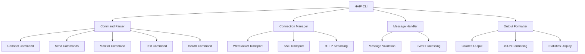

<Note>
  **New protocol version released**: This page may contain outdated information.
</Note>

## Overview

The HAIP CLI is a comprehensive command-line interface for the Human-Agent Interaction Protocol (HAIP), providing developers and system administrators with powerful tools for testing, monitoring, and interacting with HAIP servers. Built with TypeScript and featuring a beautiful terminal interface, the CLI supports all major HAIP protocol features.

<CardGroup cols={2}>
  <Card title="Multiple Transports" icon="network-wired" href="/cli/commands">
    WebSocket, SSE, and HTTP streaming support with automatic connection
    management.
  </Card>
  <Card title="Real-time Monitoring" icon="eye" href="/cli/commands">
    Monitor server events with filtering, formatting, and follow mode.
  </Card>
  <Card title="Performance Testing" icon="chart-line" href="/cli/commands">
    Test server connectivity and performance with configurable parameters.
  </Card>
  <Card title="Health Checks" icon="heart" href="/cli/commands">
    Check server health status with JSON and text output formats.
  </Card>
  <Card title="Message Sending" icon="message" href="/cli/commands">
    Send text messages, tool calls, and run commands with full protocol support.
  </Card>
  <Card title="Interactive Mode" icon="terminal" href="/cli/commands">
    Connect and interact with servers in real-time with verbose logging.
  </Card>
</CardGroup>

## Features

### **Core CLI Framework**

- **Beautiful UI** - Colored output with chalk, loading spinners with ora, and ASCII art with figlet
- **TypeScript Support** - Full type safety with comprehensive type definitions
- **Error Handling** - Robust error handling with user-friendly error messages
- **Help System** - Comprehensive help and documentation for all commands

### **Connection Management**

- **Multiple Transport Support** - WebSocket, SSE, and HTTP streaming
- **Authentication** - JWT token support with validation
- **Reconnection Logic** - Automatic reconnection with exponential backoff
- **Heartbeat System** - Automatic ping/pong for connection health monitoring
- **Connection State Tracking** - Real-time connection state and statistics

### **Advanced Features**

<CardGroup cols={2}>
  <Card title="Flow Control" icon="sliders">
    Credit-based flow control with back-pressure management
  </Card>
  <Card title="Binary Data Support" icon="database">
    Audio chunks and binary frame handling
  </Card>
  <Card title="Session Management" icon="users">
    Session ID tracking and resumption
  </Card>
  <Card title="Statistics Tracking" icon="chart-line">
    Message counts, byte transfer, and performance metrics
  </Card>
  <Card title="Configuration" icon="gear">
    Environment variable support for default settings
  </Card>
</CardGroup>

## Quick Start

```bash
# Install from source
git clone https://github.com/haiprotocol/haip-cli.git
cd haip-cli
npm install
npm run build

# Check server health
node dist/index.js health

# Connect to server
node dist/index.js connect ws://localhost:8080

# Send a message
node dist/index.js send text "Hello, HAIP!"

# Monitor events
node dist/index.js monitor --follow
```

## Architecture

The CLI is built with a modular architecture that separates concerns and provides flexibility:



### **Key Components**

#### **Command System**

- **Commander.js Integration** - Complete command-line argument parsing
- **Subcommand Support** - Nested commands for complex operations
- **Help Generation** - Automatic help text and usage examples
- **Option Validation** - Type checking and validation for all options

#### **Connection Layer**

- **Transport Abstraction** - Unified interface for all transport types
- **Connection Pooling** - Efficient connection management
- **Error Recovery** - Automatic retry and reconnection logic
- **State Management** - Real-time connection state tracking

#### **Message Processing**

- **Protocol Compliance** - Full HAIP 1.1.2 protocol support
- **Message Validation** - Schema validation for all message types
- **Event Handling** - Comprehensive event processing and routing
- **Binary Support** - Audio and binary data handling

#### **Output System**

- **Colored Terminal** - Beautiful, readable output with syntax highlighting
- **Multiple Formats** - Text, JSON, and structured output options
- **Progress Indicators** - Loading spinners and progress bars
- **Error Reporting** - Clear, actionable error messages

## Protocol Support

The HAIP CLI implements the complete HAIP 1.1.2 protocol specification:

<CardGroup cols={3}>
  <Card title="Core Events" icon="bolt">
    **HAI** - Protocol handshake and version negotiation
    <br />
    **PING/PONG** - Heartbeat and connection health monitoring
    <br />
    **ERROR** - Error reporting and handling
  </Card>
  <Card title="Messaging Events" icon="message">
    **MESSAGE_START/PART/END** - Text message streaming
    <br />
    **AUDIO_CHUNK** - Audio data transmission
    <br />
    **Message Channels** - USER, AGENT, SYSTEM, AUDIO_IN, AUDIO_OUT
  </Card>
  <Card title="Run Management" icon="play">
    **RUN_STARTED** - Start new conversation runs
    <br />
    **RUN_FINISHED** - Complete runs with status and summary
    <br />
    **RUN_CANCEL** - Cancel active runs
    <br />
    **RUN_ERROR** - Error handling for runs
  </Card>
</CardGroup>

<CardGroup cols={2}>
  <Card title="Tool Integration" icon="wrench">
    **TOOL_CALL** - Invoke tools with parameters
    <br />
    **TOOL_UPDATE** - Tool progress updates
    <br />
    **TOOL_DONE** - Tool completion with results
    <br />
    **TOOL_CANCEL** - Cancel tool execution
    <br />
    **TOOL_LIST** - Discover available tools
    <br />
    **TOOL_SCHEMA** - Tool schema definitions
  </Card>
  <Card title="Flow Control" icon="sliders">
    **FLOW_UPDATE** - Credit-based flow control
    <br />
    **PAUSE_CHANNEL** - Channel pause for back-pressure
    <br />
    **RESUME_CHANNEL** - Channel resume after pause
  </Card>
</CardGroup>

## Use Cases

<CardGroup cols={3}>
  <Card title="Development & Testing" icon="vial">
    **Protocol Testing** - Validate HAIP protocol implementations
    <br />
    **Server Testing** - Test server functionality and performance
    <br />
    **Debugging** - Monitor and debug HAIP applications
    <br />
    **Integration Testing** - Test client-server integration
  </Card>
  <Card title="Production Monitoring" icon="chart-line">
    **Health Monitoring** - Monitor server health and status
    <br />
    **Performance Monitoring** - Track message throughput and latency
    <br />
    **Error Monitoring** - Monitor and debug production issues
    <br />
    **Load Testing** - Test server performance under load
  </Card>
  <Card title="Administration" icon="gear">
    **Server Management** - Manage HAIP server instances
    <br />
    **Configuration Testing** - Test server configurations
    <br />
    **Deployment Validation** - Validate deployments and configurations
    <br />
    **Troubleshooting** - Diagnose and resolve issues
  </Card>
</CardGroup>

## Next Steps

- [Installation Guide](/cli/installation) - Set up the CLI
- [Quick Start](/cli/quickstart) - Get up and running quickly
- [Command Reference](/cli/commands) - Complete command documentation
- [Configuration](/cli/configuration) - Configure the CLI
- [Examples](/cli/examples) - Usage examples and patterns
