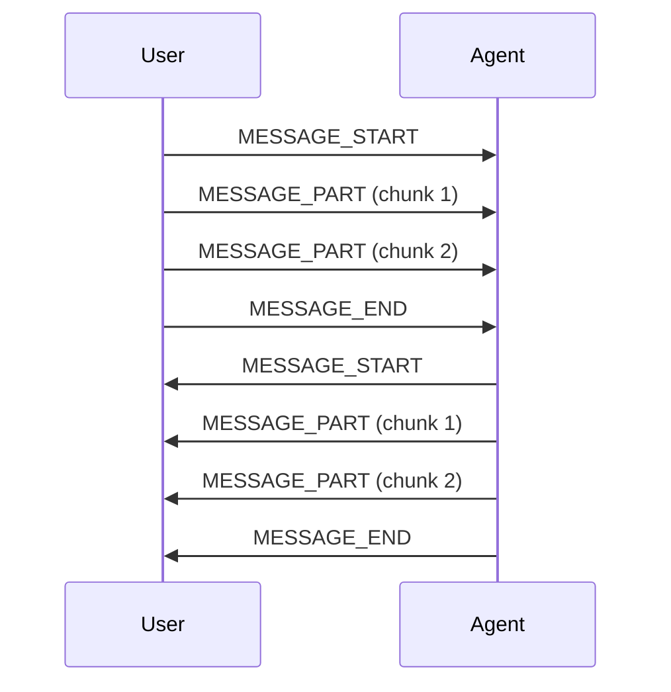

## Overview

HAIP supports both text and audio messaging with streaming capabilities, allowing for real-time, multi-modal conversations between users and agents.

## Text Messaging

Text messages in HAIP are streamed in chunks to support real-time typing indicators and progressive rendering.

### Message Flow



### Sending Text Messages

```typescript
class HAIPTextMessaging {
  private sessionId: string;
  private seqCounter = 1;

  sendTextMessage(text: string) {
    const messageId = this.generateUUID();

    // Start message
    this.send({
      type: "MESSAGE_START",
      channel: "USER",
      payload: {
        message_id: messageId,
        author: "USER",
        text: text,
      },
    });

    // End message
    this.send({
      type: "MESSAGE_END",
      channel: "USER",
      payload: {
        message_id: messageId,
      },
    });
  }

  sendStreamingText(text: string, chunkSize: number = 50) {
    const messageId = this.generateUUID();

    // Start message
    this.send({
      type: "MESSAGE_START",
      channel: "USER",
      payload: {
        message_id: messageId,
        author: "USER",
      },
    });

    // Send text in chunks
    for (let i = 0; i < text.length; i += chunkSize) {
      const chunk = text.slice(i, i + chunkSize);
      this.send({
        type: "MESSAGE_PART",
        channel: "USER",
        payload: {
          message_id: messageId,
          text: chunk,
        },
      });
    }

    // End message
    this.send({
      type: "MESSAGE_END",
      channel: "USER",
      payload: {
        message_id: messageId,
      },
    });
  }
}
```

### Receiving Text Messages

```typescript
class HAIPTextReceiver {
  private messageBuffers = new Map<string, string>();
  private messageCallbacks = new Map<string, (text: string) => void>();

  handleMessage(message: any) {
    switch (message.type) {
      case "MESSAGE_START":
        this.handleMessageStart(message);
        break;
      case "MESSAGE_PART":
        this.handleMessagePart(message);
        break;
      case "MESSAGE_END":
        this.handleMessageEnd(message);
        break;
    }
  }

  private handleMessageStart(message: any) {
    const { message_id, author, text } = message.payload;

    // Initialize buffer for this message
    this.messageBuffers.set(message_id, text || "");

    // Notify UI that message started
    this.onMessageStart?.(message_id, author);
  }

  private handleMessagePart(message: any) {
    const { message_id, text } = message.payload;

    // Append text to buffer
    const buffer = this.messageBuffers.get(message_id) || "";
    this.messageBuffers.set(message_id, buffer + text);

    // Notify UI of partial content
    this.onMessagePart?.(message_id, text);
  }

  private handleMessageEnd(message: any) {
    const { message_id, tokens } = message.payload;

    // Get complete message
    const completeText = this.messageBuffers.get(message_id) || "";

    // Clean up
    this.messageBuffers.delete(message_id);

    // Notify UI that message is complete
    this.onMessageEnd?.(message_id, completeText, tokens);
  }
}
```

## Audio Messaging

Audio messages support real-time streaming with binary data for efficient transmission.

### Audio Formats

HAIP supports various audio formats:

| Format | MIME Type    | Use Case                   |
| ------ | ------------ | -------------------------- |
| Opus   | `audio/opus` | Voice chat, low bandwidth  |
| WebM   | `audio/webm` | Web browser recording      |
| MP3    | `audio/mpeg` | Legacy compatibility       |
| WAV    | `audio/wav`  | High quality, uncompressed |

### Sending Audio Messages

```typescript
class HAIPAudioMessaging {
  private sessionId: string;
  private seqCounter = 1;

  sendAudioChunk(audioData: ArrayBuffer, messageId: string, mimeType: string = 'audio/opus') {
    // Send envelope first
    const envelope = {
      id: this.generateUUID(),
      session: this.sessionId,
      seq: this.seqCounter++.toString(),
      ts: Date.now().toString(),
      channel: "USER",
      type: "AUDIO_CHUNK",
      bin_len: audioData.byteLength,
      bin_mime: mimeType,
      payload: {
        message_id: messageId,
        mime: mimeType,
        duration_ms: this.calculateDuration(audioData, mimeType).toString()
      }
    };

    this.ws.send(JSON.stringify(envelope));

    // Send binary data in second frame
    this.ws.send(audioData);
  }

  sendAudioStream(mediaStream: MediaStream, messageId: string) {
    const audioContext = new AudioContext();
    const source = audioContext.createMediaStreamSource(mediaStream);
    const processor = audioContext.createScriptProcessor(4096, 1, 1);

    processor.onaudioprocess = (event) => {
      const audioData = event.inputBuffer.getChannelData(0);
      const buffer = this.convertToOpus(audioData);

      this.sendAudioChunk(buffer, messageId, 'audio/opus');
    };

    source.connect(processor);
    processor.connect(audioContext.destination);
  }

  private convertToOpus(audioData: Float32Array): ArrayBuffer {
    // Convert Float32Array to Opus format
    // This is a simplified example - use a proper Opus encoder in production
    const buffer = new ArrayBuffer(audioData.length * 2);
    const view = new DataView(buffer);

    for (let i = 0; i < audioData.length; i++) {
      view.setInt16(i * 2, audioData[i] * 32767, true);
    }

    return buffer;
  }

  private calculateDuration(audioData: ArrayBuffer, mimeType: string): number {
    // Calculate duration based on format and data size
    // This is a simplified calculation
    const sampleRate = 48000; // Opus default
    const channels = 1;
    const bytesPerSample = 2;

    return (audioData.byteLength / (sampleRate * channels * bytesPerSample)) * 1000;
  }
}
```

### Receiving Audio Messages

```typescript
class HAIPAudioReceiver {
  private audioBuffers = new Map<string, ArrayBuffer[]>();
  private audioContext: AudioContext;

  constructor() {
    this.audioContext = new AudioContext();
  }

  handleAudioChunk(message: any, binaryData: ArrayBuffer) {
    const { message_id, mime, duration_ms } = message.payload;

    // Store audio chunk
    if (!this.audioBuffers.has(message_id)) {
      this.audioBuffers.set(message_id, []);
    }

    this.audioBuffers.get(message_id)!.push(binaryData);

    // Play audio if it's a complete chunk
    this.playAudioChunk(message_id, binaryData, mime);
  }

  private playAudioChunk(
    messageId: string,
    audioData: ArrayBuffer,
    mimeType: string
  ) {
    // Decode and play audio
    this.audioContext
      .decodeAudioData(audioData)
      .then((audioBuffer) => {
        const source = this.audioContext.createBufferSource();
        source.buffer = audioBuffer;
        source.connect(this.audioContext.destination);
        source.start();
      })
      .catch((error) => {
        console.error("Audio decode error:", error);
      });
  }

  // For complete audio messages
  handleCompleteAudio(messageId: string, mimeType: string) {
    const chunks = this.audioBuffers.get(messageId);
    if (!chunks) return;

    // Combine all chunks
    const totalLength = chunks.reduce(
      (sum, chunk) => sum + chunk.byteLength,
      0
    );
    const combinedBuffer = new ArrayBuffer(totalLength);
    const view = new Uint8Array(combinedBuffer);

    let offset = 0;
    for (const chunk of chunks) {
      view.set(new Uint8Array(chunk), offset);
      offset += chunk.byteLength;
    }

    // Play complete audio
    this.playAudioChunk(messageId, combinedBuffer, mimeType);

    // Clean up
    this.audioBuffers.delete(messageId);
  }
}
```

## Message Sequencing

HAIP uses sequence numbers to ensure message ordering and handle out-of-order delivery.

### Sequence Management

```typescript
class HAIPSequenceManager {
  private lastReceivedSeq = 0;
  private pendingMessages = new Map<number, any>();
  private replayWindow = 1000; // Keep last 1000 messages

  handleMessage(message: any) {
    const seq = parseInt(message.seq);

    // Check if message is in order
    if (seq === this.lastReceivedSeq + 1) {
      this.processMessage(message);
      this.lastReceivedSeq = seq;

      // Process any pending messages that are now in order
      this.processPendingMessages();
    } else if (seq > this.lastReceivedSeq + 1) {
      // Message is out of order, store it
      this.pendingMessages.set(seq, message);

      // Request replay if gap is too large
      if (seq - this.lastReceivedSeq > 10) {
        this.requestReplay(this.lastReceivedSeq + 1, seq - 1);
      }
    } else {
      // Message is too old, ignore it
      console.warn('Received old message:', seq);
    }
  }

  private processPendingMessages() {
    while (this.pendingMessages.has(this.lastReceivedSeq + 1)) {
      const message = this.pendingMessages.get(this.lastReceivedSeq + 1)!;
      this.processMessage(message);
      this.lastReceivedSeq++;
      this.pendingMessages.delete(this.lastReceivedSeq);
    }
  }

  private requestReplay(fromSeq: number, toSeq: number) {
    const replayRequest = {
      id: this.generateUUID(),
      session: this.sessionId,
      seq: this.seqCounter++.toString(),
      ts: Date.now().toString(),
      channel: "SYSTEM",
      type: "REPLAY_REQUEST",
      payload: {
        from_seq: fromSeq.toString(),
        to_seq: toSeq.toString()
      }
    };

    this.ws.send(JSON.stringify(replayRequest));
  }

  private processMessage(message: any) {
    // Handle the message based on its type
    switch (message.type) {
      case 'MESSAGE_START':
      case 'MESSAGE_PART':
      case 'MESSAGE_END':
        this.textReceiver.handleMessage(message);
        break;
      case 'AUDIO_CHUNK':
        this.audioReceiver.handleMessage(message);
        break;
      // ... other message types
    }
  }
}
```

## Message Channels

HAIP supports multiple channels for different types of communication.

### Channel Types

| Channel     | Purpose           | Example                      |
| ----------- | ----------------- | ---------------------------- |
| `USER`      | User messages     | Text input, voice commands   |
| `AGENT`     | Agent responses   | AI responses, tool results   |
| `SYSTEM`    | Protocol messages | Handshake, ping/pong, errors |
| `AUDIO_IN`  | Audio input       | Microphone stream            |
| `AUDIO_OUT` | Audio output      | Speaker stream               |

### Channel Management

```typescript
class HAIPChannelManager {
  private channels = new Map<string, HAIPChannel>();

  constructor() {
    // Initialize default channels
    this.createChannel("USER", { maxMessages: 100, maxBytes: 1024 * 1024 });
    this.createChannel("AGENT", { maxMessages: 100, maxBytes: 1024 * 1024 });
    this.createChannel("SYSTEM", { maxMessages: 50, maxBytes: 512 * 1024 });
    this.createChannel("AUDIO_IN", {
      maxMessages: 1000,
      maxBytes: 10 * 1024 * 1024,
    });
    this.createChannel("AUDIO_OUT", {
      maxMessages: 1000,
      maxBytes: 10 * 1024 * 1024,
    });
  }

  createChannel(name: string, config: ChannelConfig) {
    this.channels.set(name, new HAIPChannel(name, config));
  }

  sendMessage(channel: string, message: any) {
    const channelObj = this.channels.get(channel);
    if (!channelObj) {
      throw new Error(`Channel ${channel} not found`);
    }

    return channelObj.sendMessage(message);
  }

  pauseChannel(channel: string) {
    const channelObj = this.channels.get(channel);
    if (channelObj) {
      channelObj.pause();
    }
  }

  resumeChannel(channel: string) {
    const channelObj = this.channels.get(channel);
    if (channelObj) {
      channelObj.resume();
    }
  }
}

class HAIPChannel {
  private name: string;
  private config: ChannelConfig;
  private messageCount = 0;
  private byteCount = 0;
  private isPaused = false;

  constructor(name: string, config: ChannelConfig) {
    this.name = name;
    this.config = config;
  }

  sendMessage(message: any): boolean {
    if (this.isPaused) {
      return false;
    }

    const messageSize = JSON.stringify(message).length;

    if (
      this.messageCount >= this.config.maxMessages ||
      this.byteCount + messageSize >= this.config.maxBytes
    ) {
      return false;
    }

    this.messageCount++;
    this.byteCount += messageSize;

    return true;
  }

  pause() {
    this.isPaused = true;
  }

  resume() {
    this.isPaused = false;
  }
}
```

## Best Practices

<CardGroup cols={2}>

<Card title="Chunking" icon="puzzle-piece">
  Break large messages into smaller chunks for better streaming and user
  experience.
</Card>

<Card title="Buffering" icon="database">
  Implement proper buffering for audio messages to handle network jitter.
</Card>

<Card title="Error Recovery" icon="exclamation">
  Automatic recovery from message corruption and network interruptions.
</Card>

{" "}

<Card title="Performance" icon="arrow-up">
  Use binary frames for audio data and compress text when appropriate.
</Card>

</CardGroup>
