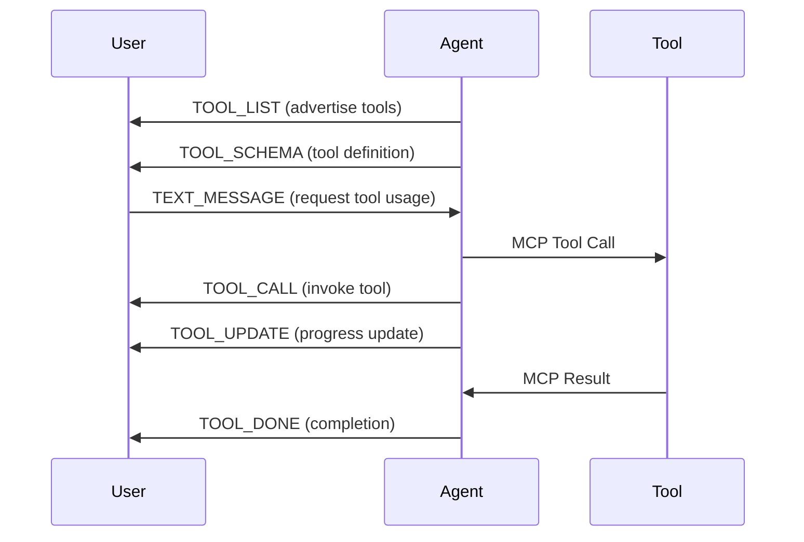

## Overview

HAIP provides seamless integration with external tools and APIs through the Model Context Protocol (MCP). Tools can be dynamically advertised, invoked, and monitored with real-time progress updates.

## Tool Lifecycle



## Tool Advertisement

### Tool List

Agents advertise available tools using the `TOOL_LIST` event:

```typescript
class HAIPToolManager {
  private tools = new Map<string, ToolDefinition>();
  
  advertiseTools() {
    const toolList = {
      id: this.generateUUID(),
      session: this.sessionId,
      seq: this.seqCounter++.toString(),
      ts: Date.now().toString(),
      channel: "AGENT",
      type: "TOOL_LIST",
      payload: {
        tools: Array.from(this.tools.values()).map(tool => ({
          name: tool.name,
          description: tool.description
        }))
      }
    };
    
    this.ws.send(JSON.stringify(toolList));
  }
  
  addTool(name: string, description: string, schema: any) {
    this.tools.set(name, { name, description, schema });
  }
}
```

### Tool Schema

Detailed tool schemas are provided using the `TOOL_SCHEMA` event:

```typescript
class HAIPToolSchema {
  sendToolSchema(toolName: string) {
    const tool = this.tools.get(toolName);
    if (!tool) return;
    
    const schemaMessage = {
      id: this.generateUUID(),
      session: this.sessionId,
      seq: this.seqCounter++.toString(),
      ts: Date.now().toString(),
      channel: "AGENT",
      type: "TOOL_SCHEMA",
      payload: {
        tool: toolName,
        schema: tool.schema
      }
    };
    
    this.ws.send(JSON.stringify(schemaMessage));
  }
}

// Example tool schema
const weatherToolSchema = {
  type: "object",
  properties: {
    location: {
      type: "string",
      description: "City name or coordinates"
    },
    units: {
      type: "string",
      enum: ["celsius", "fahrenheit"],
      default: "celsius"
    }
  },
  required: ["location"]
};
```

## Tool Invocation

### Tool Call

Tools are invoked using the `TOOL_CALL` event:

```typescript
class HAIPToolInvoker {
  private activeCalls = new Map<string, ToolCall>();
  
  invokeTool(toolName: string, params: any) {
    const callId = this.generateUUID();
    
    const toolCall = {
      id: this.generateUUID(),
      session: this.sessionId,
      seq: this.seqCounter++.toString(),
      ts: Date.now().toString(),
      channel: "AGENT",
      type: "TOOL_CALL",
      payload: {
        call_id: callId,
        tool: toolName,
        params: params
      }
    };
    
    // Track active call
    this.activeCalls.set(callId, {
      id: callId,
      tool: toolName,
      params: params,
      status: 'QUEUED',
      startTime: Date.now()
    });
    
    this.ws.send(JSON.stringify(toolCall));
    return callId;
  }
  
  // Example: Get weather information
  getWeather(location: string, units: 'celsius' | 'fahrenheit' = 'celsius') {
    return this.invokeTool('get_weather', {
      location: location,
      units: units
    });
  }
  
  // Example: Search the web
  searchWeb(query: string, maxResults: number = 5) {
    return this.invokeTool('web_search', {
      query: query,
      max_results: maxResults
    });
  }
}
```

### Tool Updates

Long-running tools can provide progress updates:

```typescript
class HAIPToolProgress {
  updateToolProgress(callId: string, status: 'QUEUED' | 'RUNNING' | 'CANCELLING', progress?: number, partial?: any) {
    const update = {
      id: this.generateUUID(),
      session: this.sessionId,
      seq: this.seqCounter++.toString(),
      ts: Date.now().toString(),
      channel: "AGENT",
      type: "TOOL_UPDATE",
      payload: {
        call_id: callId,
        status: status,
        progress: progress,
        partial: partial
      }
    };
    
    this.ws.send(JSON.stringify(update));
  }
  
  // Example: File upload progress
  updateFileUploadProgress(callId: string, bytesUploaded: number, totalBytes: number) {
    const progress = Math.round((bytesUploaded / totalBytes) * 100);
    const partial = {
      bytes_uploaded: bytesUploaded,
      total_bytes: totalBytes
    };
    
    this.updateToolProgress(callId, 'RUNNING', progress, partial);
  }
  
  // Example: Database query progress
  updateQueryProgress(callId: string, rowsProcessed: number, totalRows: number) {
    const progress = Math.round((rowsProcessed / totalRows) * 100);
    const partial = {
      rows_processed: rowsProcessed,
      total_rows: totalRows
    };
    
    this.updateToolProgress(callId, 'RUNNING', progress, partial);
  }
}
```

### Tool Completion

Tools signal completion with the `TOOL_DONE` event:

```typescript
class HAIPToolCompletion {
  completeTool(callId: string, result?: any, status: 'OK' | 'CANCELLED' | 'ERROR' = 'OK') {
    const completion = {
      id: this.generateUUID(),
      session: this.sessionId,
      seq: this.seqCounter++.toString(),
      ts: Date.now().toString(),
      channel: "AGENT",
      type: "TOOL_DONE",
      payload: {
        call_id: callId,
        status: status,
        result: result
      }
    };
    
    this.ws.send(JSON.stringify(completion));
    
    // Clean up active call
    this.activeCalls.delete(callId);
  }
  
  // Example: Weather tool completion
  completeWeatherTool(callId: string, weatherData: any) {
    this.completeTool(callId, {
      temperature: weatherData.temp,
      condition: weatherData.condition,
      humidity: weatherData.humidity,
      wind_speed: weatherData.wind_speed
    });
  }
  
  // Example: Error completion
  completeWithError(callId: string, error: string) {
    this.completeTool(callId, {
      error: error,
      timestamp: new Date().toISOString()
    }, 'ERROR');
  }
}
```

## Tool Cancellation

Tools can be cancelled using the `TOOL_CANCEL` event:

```typescript
class HAIPToolCancellation {
  cancelTool(callId: string, reason?: string) {
    const cancellation = {
      id: this.generateUUID(),
      session: this.sessionId,
      seq: this.seqCounter++.toString(),
      ts: Date.now().toString(),
      channel: "AGENT",
      type: "TOOL_CANCEL",
      payload: {
        call_id: callId,
        reason: reason
      }
    };
    
    this.ws.send(JSON.stringify(cancellation));
    
    // Update local state
    const call = this.activeCalls.get(callId);
    if (call) {
      call.status = 'CANCELLING';
    }
  }
  
  // Example: Cancel long-running operation
  cancelFileUpload(callId: string) {
    this.cancelTool(callId, 'User cancelled upload');
    
    // Also cancel the actual operation
    this.cancelActualUpload(callId);
  }
}
```

## MCP Integration

HAIP seamlessly integrates with the Model Context Protocol for tool execution.

### MCP Tool Handler

```typescript
class HAIPMCPHandler {
  private mcpClient: MCPClient;
  
  constructor() {
    this.mcpClient = new MCPClient();
  }
  
  async handleToolCall(toolCall: any) {
    const { call_id, tool, params } = toolCall.payload;
    
    try {
      // Send progress update
      this.updateToolProgress(call_id, 'RUNNING', 0);
      
      // Execute tool via MCP
      const result = await this.mcpClient.callTool(tool, params);
      
      // Send completion
      this.completeTool(call_id, result);
      
    } catch (error) {
      console.error('Tool execution failed:', error);
      this.completeWithError(call_id, error.message);
    }
  }
  
  async handleLongRunningTool(toolCall: any) {
    const { call_id, tool, params } = toolCall.payload;
    
    try {
      // Start the operation
      const operation = await this.mcpClient.startLongRunningTool(tool, params);
      
      // Monitor progress
      operation.onProgress((progress) => {
        this.updateToolProgress(call_id, 'RUNNING', progress.percentage, progress.partial);
      });
      
      // Wait for completion
      const result = await operation.waitForCompletion();
      
      // Send completion
      this.completeTool(call_id, result);
      
    } catch (error) {
      this.completeWithError(call_id, error.message);
    }
  }
}
```

### MCP Tool Registration

```typescript
class HAIPMCPToolRegistry {
  private mcpTools = new Map<string, MCPTool>();
  
  async registerMCPTools() {
    // Discover MCP tools
    const tools = await this.mcpClient.listTools();
    
    for (const tool of tools) {
      this.mcpTools.set(tool.name, tool);
      
      // Advertise tool in HAIP
      this.addTool(tool.name, tool.description, tool.schema);
    }
    
    // Send tool list
    this.advertiseTools();
  }
  
  async getToolSchema(toolName: string) {
    const tool = this.mcpTools.get(toolName);
    if (!tool) {
      throw new Error(`Tool ${toolName} not found`);
    }
    
    return tool.schema;
  }
}
```

## Tool Examples

See the [SDK Tools](/sdk/tools) guide for detailed tool implementation examples.

### File Upload Tool

```typescript
class FileUploadTool {
  async uploadFile(file: File, callId: string) {
    const formData = new FormData();
    formData.append('file', file);
    
    const xhr = new XMLHttpRequest();
    
    return new Promise((resolve, reject) => {
      xhr.upload.onprogress = (event) => {
        if (event.lengthComputable) {
          const progress = Math.round((event.loaded / event.total) * 100);
          this.updateToolProgress(callId, 'RUNNING', progress, {
            bytes_uploaded: event.loaded,
            total_bytes: event.total
          });
        }
      };
      
      xhr.onload = () => {
        if (xhr.status === 200) {
          const result = JSON.parse(xhr.responseText);
          this.completeTool(callId, result);
          resolve(result);
        } else {
          this.completeWithError(callId, `Upload failed: ${xhr.statusText}`);
          reject(new Error(xhr.statusText));
        }
      };
      
      xhr.onerror = () => {
        this.completeWithError(callId, 'Network error during upload');
        reject(new Error('Network error'));
      };
      
      xhr.open('POST', '/api/upload');
      xhr.send(formData);
    });
  }
}
```

### Database Query Tool

```typescript
class DatabaseQueryTool {
  async executeQuery(query: string, callId: string) {
    try {
      // Start query execution
      this.updateToolProgress(callId, 'RUNNING', 0);
      
      const connection = await this.getDatabaseConnection();
      const result = await connection.query(query);
      
      // Process results in batches
      const batchSize = 1000;
      const totalRows = result.rows.length;
      
      for (let i = 0; i < totalRows; i += batchSize) {
        const batch = result.rows.slice(i, i + batchSize);
        
        // Process batch
        await this.processBatch(batch);
        
        // Update progress
        const progress = Math.round(((i + batchSize) / totalRows) * 100);
        this.updateToolProgress(callId, 'RUNNING', progress, {
          rows_processed: Math.min(i + batchSize, totalRows),
          total_rows: totalRows
        });
      }
      
      this.completeTool(callId, {
        rows_affected: result.rowCount,
        execution_time: result.executionTime
      });
      
    } catch (error) {
      this.completeWithError(callId, error.message);
    }
  }
}
```

## Tool Management

### Tool State Management

```typescript
class HAIPToolStateManager {
  private toolStates = new Map<string, ToolState>();
  
  getToolState(callId: string): ToolState | undefined {
    return this.toolStates.get(callId);
  }
  
  setToolState(callId: string, state: Partial<ToolState>) {
    const currentState = this.toolStates.get(callId) || {};
    this.toolStates.set(callId, { ...currentState, ...state });
  }
  
  cleanupTool(callId: string) {
    this.toolStates.delete(callId);
  }
  
  // Get all active tools
  getActiveTools(): ToolState[] {
    return Array.from(this.toolStates.values());
  }
  
  // Get tools by status
  getToolsByStatus(status: string): ToolState[] {
    return Array.from(this.toolStates.values())
      .filter(tool => tool.status === status);
  }
}

interface ToolState {
  callId: string;
  tool: string;
  status: 'QUEUED' | 'RUNNING' | 'CANCELLING' | 'COMPLETED' | 'ERROR';
  startTime: number;
  endTime?: number;
  progress?: number;
  result?: any;
  error?: string;
}
```

## Best Practices

<CardGroup cols={2}>

<Card title="Progress Updates" icon="chart-line">
  Provide regular progress updates for long-running operations to keep users informed.
</Card>

<Card title="Error Handling" icon="exclamation">
  Comprehensive error handling with detailed error reporting and recovery.
</Card>

<Card title="Resource Management" icon="database">
  Clean up resources and cancel operations when tools are cancelled or sessions end.
</Card>

<Card title="Schema Validation" icon="check">
  Automatic validation of tool schemas and argument types for type safety.
</Card>

</CardGroup> 