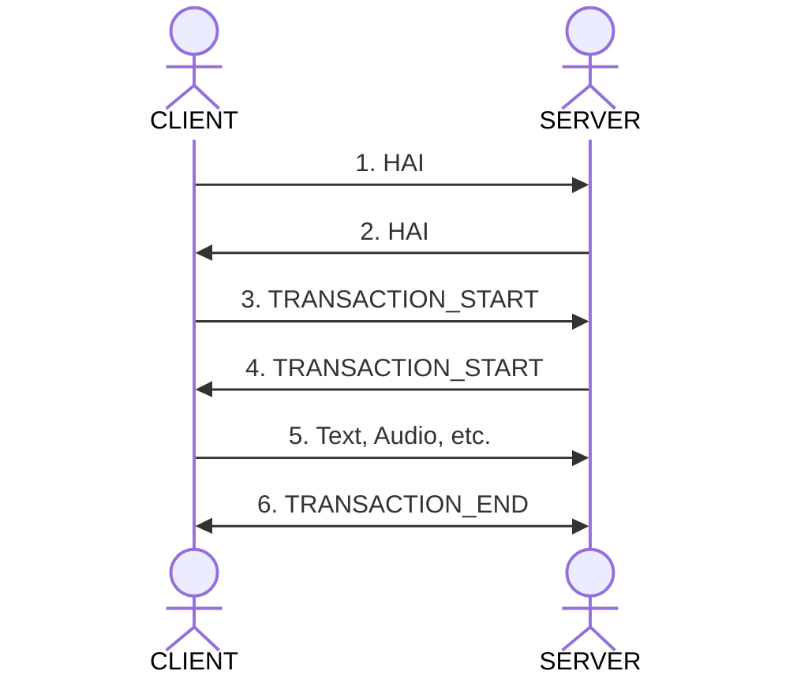

## Messages

The protocol can connect using various protocols.

- WebSockets
- Server-Sent Events (SSE)
- Http Streaming

The messages follow a standard format:

```
{"id":"359287d7-0ed6-455a-8685-c1d67aedd0dd","transaction":"92d6fd15-05d0-411d-a907-f29c8e998c93","session":"d0515bd2-9c57-47d2-80d9-587238977318","seq":"1755187354681","ts":"1755187354681","channel":"USER","type":"MESSAGE_PART","payload":{"message_id":"5b1e23b1-b56e-45a7-ab25-3880755eca9b","text":"Hello There"}}
```

The parts are:

- **id** – Message ID
- **transaction** – The Transaction (can be thought of a chat instance). What this looks like for you may vary, it may be a topic or or a customer website visit.
- **session** – The session (can be thought of the individual client)
- **seq** – Sequence ID
- **ts** – Timestamp
- **channel** – The channel name: `USER`, `AGENT`, `SYSTEM`
- **type** – The [message type](https://github.com/haiprotocol/haip/tree/main/%40types/constants.ts). eg. `HAI`, `TRANSACTION_START`, `MESSAGE_START`.
- **payload** – Custom payload for the data

## Handshakes

The handsake process is as follows:



0. The client connects to the server.
1. The client sends a `HAI` containing its capabilities and auth credentials.
   The server validates the auth credentials.
2. The server sends back a `HAI` message with its capabilities.
   The client is now ready to communicate.
3. The client starts a transaction. With a `START_TRANSACTION` message.
   The server creates a transaction and sends back the transaction id.
4. The sever responds with the a `START_TRANSACTION`
5. The client can then send messages/audio to that transaction.
6. Close the transaction when finished.

## Authentication & Authorisation

We support a wide range of Authentication protocols.
On the client implement this method.

```javascript
HAIPClient.authenticate(authFn: () => Record<string, any>): void
```

In our examples we send `{token: "Bearer TOKEN" }`. This can be then validated on the server by implementing the method:

```javascript
HAIPServer.authenticate(fn: (req: any) => HAIPUser | null): void
```

Our example implements this with the following code. It checks for that exact string in the token. And then creates the user. If the token does not match that string it returns `null` which acts causes the authentication to fail.

```javascript
server.authenticate((req) => {
  if (req.token === "Bearer TOKEN") {
    return {
      id: "user123",
      permissions: createPermissionMap({ MESSAGE: ["*"] }),
      credits: 1000,
    };
  }
  return null;
});
```

This defines the user, the ID should be a unchanging primary key that you use for that user.

The permissions set what methods the user is allowed to call. In the case above it is allowing the user to call `MESSAGE` for all transactions.

We also set the amount of credits the user has access to, this depends on if flow control has been enabled.

## Message History

The server stores a message history for each transaction. Using the javascript SDK this can be accessed with `transaction.getReplayWindow();`.

The history size is determined by `windowSize` (number of messages) and `windowTime` (duration).
