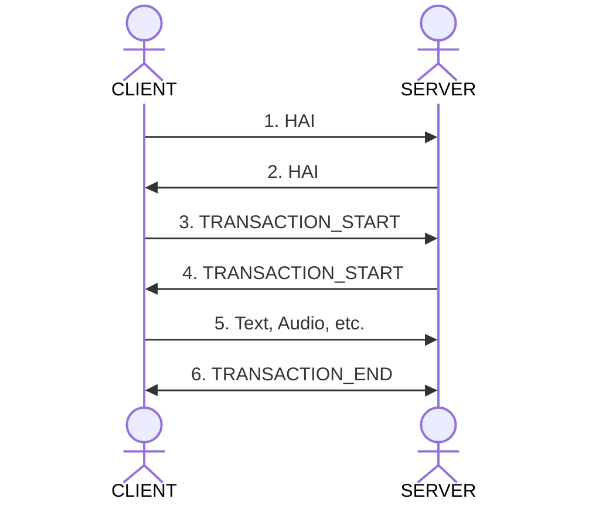

## Core Concepts

The protocol can connect using various protocols.

- Websocket
- SSE
- Http Streaming

The messages follow a standard format:

```
{"id":"359287d7-0ed6-455a-8685-c1d67aedd0dd","transaction":"92d6fd15-05d0-411d-a907-f29c8e998c93","session":"d0515bd2-9c57-47d2-80d9-587238977318","seq":"1755187354681","ts":"1755187354681","channel":"USER","type":"MESSAGE_PART","payload":{"message_id":"5b1e23b1-b56e-45a7-ab25-3880755eca9b","text":"Hello There"}}
```

The parts are:

- **id** – Message ID
- **transaction** – The Transaction (can be thought of a chat instance). What this looks like for you may vary, it may be a topic or or a customer website visit.
- **session** – The session (can be thought of the individual client)
- **seq** – Sequence ID
- **ts** – Timestamp
- **channel** – The channel name: `USER`, `AGENT`, `SYSTEM`
- **type** – The [message type](https://github.com/haiprotocol/haip/tree/main/%40types/constants.ts). eg. `HAI`, `TRANSACTION_START`, `MESSAGE_START`.
- **payload** – Custom payload for the data

### Handshake

The handsake process is as follows:



0. The client connects to the server.
1. The client sends a `HAI` containing its capabilities and auth credentials.
   The server validates the auth credentials.
2. The server sends back a `HAI` message with its capabilities.
   The client is now ready to communicate.
3. The client starts a transaction. With a `START_TRANSACTION` message.
   The server creates a transaction and sends back the transaction id.
4. The sever responds with the a `START_TRANSACTION`
5. The client can then send messages/audio to that transaction.
6. Close the transaction when finished.
