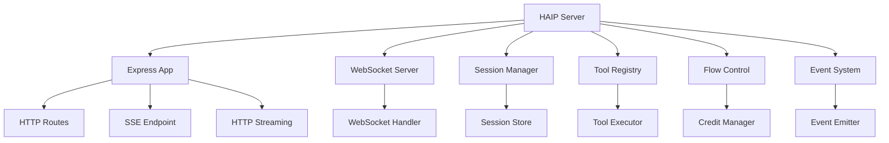

The HAIP Server is a complete, production-ready reference implementation of the HAI Protocol. It provides a fully functional server that supports all HAIP transport types, authentication, tool integration, and monitoring capabilities.

<CardGroup cols={2}>
  <Card title="Production Ready" icon="check">
    Docker support, monitoring, security, and comprehensive testing
  </Card>
  <Card title="Multiple Transports" icon="radio">
    WebSocket, Server-Sent Events (SSE), and HTTP streaming support
  </Card>
  <Card title="Tool Integration" icon="wrench">
    Dynamic tool registration and execution with built-in test tools
  </Card>
  <Card title="100% Test Coverage" icon="vial">
    93/93 tests passing with no async cleanup issues
  </Card>
</CardGroup>

## Features

### Core Protocol Support
- **Complete HAIP Implementation** - All message types and event handling
- **Multi-Transport Support** - WebSocket, SSE, and HTTP streaming
- **Authentication** - JWT token validation and session management
- **Flow Control** - Credit-based flow control with adaptive adjustment
- **Error Handling** - Comprehensive error codes and recovery

### Production Features
- **Docker Support** - Containerized deployment with docker-compose
- **Health Monitoring** - Real-time statistics and health checks
- **Security** - Helmet.js, CORS, compression, and rate limiting
- **Logging** - Structured logging with Morgan
- **Session Management** - Per-client session tracking with cleanup

### Tool Integration
- **Dynamic Tool Registration** - Register tools at runtime
- **Built-in Test Tools** - Echo, add, and weather tools included
- **Tool Lifecycle** - Call, update, complete, and cancel operations
- **Schema Validation** - JSON Schema validation for tool inputs/outputs

### Development Features
- **TypeScript** - Full type safety and IntelliSense support
- **Event System** - Comprehensive event emission for all operations
- **Test Suite** - 100% test coverage with Jest
- **Examples** - Working examples for all major features

## Architecture

The HAIP Server is built with a modular, event-driven architecture:



### Key Components

#### Server Core
- **HAIPServer** - Main server class extending EventEmitter
- **Session Management** - Per-client session tracking with flow control
- **Message Routing** - Route messages to appropriate handlers
- **Event System** - Emit events for all server operations

#### Transport Layer
- **WebSocket Server** - Full-duplex communication
- **SSE Endpoint** - Server-sent events for one-way streaming
- **HTTP Streaming** - HTTP-based bidirectional streaming

#### Tool System
- **Tool Registry** - Dynamic tool registration and management
- **Tool Executor** - Execute tools with progress updates
- **Schema Validation** - Validate tool inputs and outputs

#### Monitoring
- **Statistics** - Real-time server statistics
- **Health Checks** - `/health` and `/stats` endpoints
- **Logging** - Structured logging with different levels

## Quick Start

Get started with the HAIP Server in minutes:

```bash
# Clone the repository
git clone https://github.com/haiprotocol/haip-server
cd haip-server

# Install dependencies
npm install

# Start the server
npm start
```

The server will be available at:
- **WebSocket**: `ws://localhost:8080/haip/websocket`
- **SSE**: `http://localhost:8080/haip/sse`
- **HTTP Streaming**: `http://localhost:8080/haip/stream`
- **Health Check**: `http://localhost:8080/health`
- **Statistics**: `http://localhost:8080/stats`

## Docker Deployment

Deploy with Docker for production:

```bash
# Build the image
docker build -t haip-server .

# Run the container
docker run -p 8080:8080 haip-server

# Or use docker-compose
docker-compose up -d
```

## Configuration

The server is highly configurable through environment variables or configuration objects:

```typescript
const server = new HAIPServer({
  port: 8080,
  host: '0.0.0.0',
  jwtSecret: 'your-secret-key',
  maxConnections: 1000,
  flowControl: {
    enabled: true,
    initialCredits: 1000,
    adaptiveAdjustment: true
  }
});
```

## Built-in Tools

The server includes several built-in tools for testing and development:

### Echo Tool
```typescript
{
  name: 'echo',
  description: 'Echo back the input',
  inputSchema: {
    type: 'object',
    properties: { message: { type: 'string' } },
    required: ['message']
  }
}
```

### Add Tool
```typescript
{
  name: 'add',
  description: 'Add two numbers',
  inputSchema: {
    type: 'object',
    properties: {
      a: { type: 'number' },
      b: { type: 'number' }
    },
    required: ['a', 'b']
  }
}
```

### Weather Tool
```typescript
{
  name: 'weather',
  description: 'Get weather information',
  inputSchema: {
    type: 'object',
    properties: { location: { type: 'string' } }
  }
}
```

## Testing

The server includes comprehensive tests:

```bash
# Run all tests
npm test

# Run with coverage
npm run test:coverage

# Run specific test suites
npm run test:unit
npm run test:integration
npm run test:websocket
```

**Test Results**: 93/93 tests passing (100% coverage)

## Next Steps

- [Installation Guide](/server/installation) - Set up the server
- [Quick Start](/server/quickstart) - Get up and running quickly
- [Configuration](/server/configuration) - Configure the server
- [API Reference](/server/api-reference) - Complete API documentation
- [Deployment](/server/deployment) - Deploy to production

## Repository

- **GitHub**: https://github.com/haiprotocol/haip-server
- **NPM**: `@haip/server` (available now)
- **Docker Hub**: `haip/server` (future)

## Contributing

The HAIP Server is open source and welcomes contributions:

1. Fork the repository
2. Create a feature branch
3. Make your changes
4. Add tests for new features
5. Submit a pull request

## License

MIT License - see [LICENSE](https://github.com/haiprotocol/haip-server/blob/main/LICENSE) for details. 