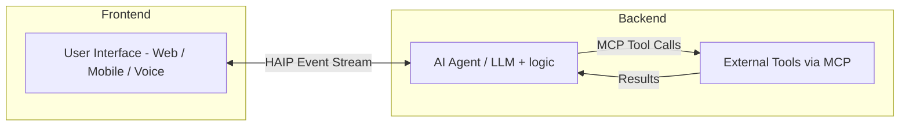

HAIP serves as a layer that wraps all communication between your Agents and the User client. It manages connections automatically, letting you focus on development while ensuring speed and reliability.

HAIP aims to be flexible and allow you to develop your solutions easily.

- Plug-in your existing identity providers.
- Service agnostic. Expose multiple agents/LLM pipelines.
- Create your own schemas.
- Run on your own infrastructure.
- Credit management.

## Architecture Overview

There are two parts to HAIP. The frontend code which will get pulled as a library and used in your frontends (eg. app, web and voice). This will then communicate using the HAIP protocol to the HAIP server running on your infrastructure.



## Why to use HAIP?

This protocol can be thought of a standard way to call LLM-like workflows. And the SDK is like `React Query` for LLM use cases. It's meant to allow you to set up connections to your LLM in an easy to manage way.

While having all the aspects that you would otherwise have to build like chat histories, credit management and flow control.

An example of a client: using our drop in React libraries.

```
This would be an example of the React Library
```

##

<Card
  title="Read the protocol overview"
  icon="book-open"
  href="/protocol/overview"
  horizontal
>
  Explore the complete HAIP API protocol specification.
</Card>

## Best Practices

<CardGroup cols={2}>

<Card
  title="Error Handling"
  icon="exclamation"
  href="/essentials/error-handling"
>
  Implement comprehensive error handling for network issues and protocol
  violations.
</Card>

<Card title="Flow Control" icon="sliders" href="/essentials/flow-control">
  Use flow control to prevent overwhelming your system with messages.
</Card>

<Card title="Authentication" icon="shield" href="/essentials/authentication">
  Always validate JWT tokens and implement proper session management.
</Card>

<Card title="Monitoring" icon="chart-line" href="/essentials/monitoring">
  Monitor connection health and message throughput in production.
</Card>

</CardGroup>

## Development Tools

<Note>
  **Development Status**: Some development tools are still in development. The
  SDK itself is fully functional and can be used for development and testing.
</Note>

### HAIP CLI

<Accordion icon="wrench" title="HAIP CLI">
  Use the HAIP CLI for testing and debugging: ```bash # Install HAIP CLI git
  clone https://github.com/haiprotocol/haip-cli.git cd haip-cli npm install npm
  run build # Test connection node dist/index.js connect ws://localhost:8080 #
  Send test message node dist/index.js send text "Hello, HAIP!" # Monitor events
  node dist/index.js monitor --follow # Test performance node dist/index.js test
  --message-count 100 ```
  <Note>
    The HAIP CLI is now fully implemented and ready for use. See the [CLI
    documentation](/cli/overview) for complete usage guide.
  </Note>
</Accordion>
