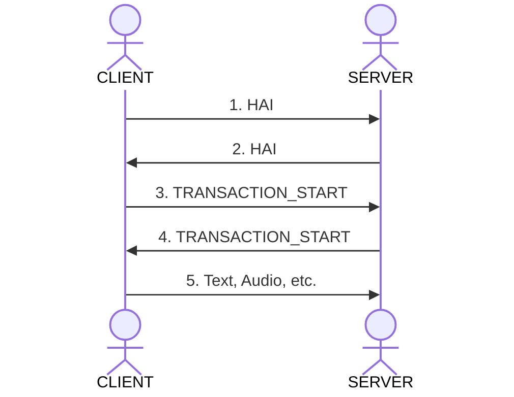

The core idea is that HAIP wraps all communication between your Agents and Users client.
This library takes care of all those technical details allowing you to get onto working on the core stuff for your project.

Features:

- Reestablishing dropped connections
- Multimodal transactions audio and text.
- Allowing multiple users and LLMs to share a conversation (transaction).
- Letting the user know about MCP (Model Context Protocol) calls.
- Custom tooling, Logging, authentication, ensuring message order and more.

For example: using our drop in React libraries.

```
This would be an example of the React Library
```

## Why would you want to use this library

This protocol can be thought of a standard way to call LLM-like workflows. And the SDK is like `React Query` for LLM use cases. It's meant to allow you to set up connections to your LLM in an easy to manage way.

## Core Concepts

The protocol can connect using various protocols.

- Websocket
- SSE
- Http Streaming

The messages follow a standard format:

```
{"id":"359287d7-0ed6-455a-8685-c1d67aedd0dd","transaction":"92d6fd15-05d0-411d-a907-f29c8e998c93","session":"d0515bd2-9c57-47d2-80d9-587238977318","seq":"1755187354681","ts":"1755187354681","channel":"USER","type":"MESSAGE_PART","payload":{"message_id":"5b1e23b1-b56e-45a7-ab25-3880755eca9b","text":"Hello There"}}
```

The parts are:

- **id** – Message ID
- **transaction** – The Transaction (can be thought of a chat)
- **session** – The session (can be thought of the individual client)
- **seq** – Sequence ID
- **ts** – Timestamp
- **channel** – The channel name: `USER`, `AGENT`, `SYSTEM`
- **type** – The message type: `HAI`, `PING`, `PONG`, `ERROR`, `FLOW_UPDATE`, `TRANSACTION_START`, `TRANSACTION_END`, `REPLAY_REQUEST`, `MESSAGE_START`, `MESSAGE_PART`, `MESSAGE_END`, `AUDIO_CHUNK`, `INFO`, `TOOL_LIST`, `TOOL_SCHEMA`
- **payload** – Custom payload for the data

### Handshake

The handsake process is as follows:



0. The client connects to the server.
1. The client sends a `HAI` containing its capabilities and auth credentials.
   The server validates the auth credential.
2. The server sends back a `HAI` message with its capabilities.
   The client is now ready to communicate.
3. The client starts a transaction. With a `START_TRANSACTION` message.
   The server creates a transaction and sends back the transaction id.
4. The sever responds with the a `START_TRANSACTION`
5. The client can then send messages/audio to that transaction.

## Best Practices

<CardGroup cols={2}>

<Card
  title="Error Handling"
  icon="exclamation"
  href="/essentials/error-handling"
>
  Implement comprehensive error handling for network issues and protocol
  violations.
</Card>

<Card title="Flow Control" icon="sliders" href="/essentials/flow-control">
  Use flow control to prevent overwhelming your system with messages.
</Card>

<Card title="Authentication" icon="shield" href="/essentials/authentication">
  Always validate JWT tokens and implement proper session management.
</Card>

<Card title="Monitoring" icon="chart-line" href="/essentials/monitoring">
  Monitor connection health and message throughput in production.
</Card>

</CardGroup>

## Development Tools

<Note>
  **Development Status**: Some development tools are still in development. The
  SDK itself is fully functional and can be used for development and testing.
</Note>

### HAIP CLI

<Accordion icon="wrench" title="HAIP CLI">
  Use the HAIP CLI for testing and debugging: ```bash # Install HAIP CLI git
  clone https://github.com/haiprotocol/haip-cli.git cd haip-cli npm install npm
  run build # Test connection node dist/index.js connect ws://localhost:8080 #
  Send test message node dist/index.js send text "Hello, HAIP!" # Monitor events
  node dist/index.js monitor --follow # Test performance node dist/index.js test
  --message-count 100 ```
  <Note>
    The HAIP CLI is now fully implemented and ready for use. See the [CLI
    documentation](/cli/overview) for complete usage guide.
  </Note>
</Accordion>
