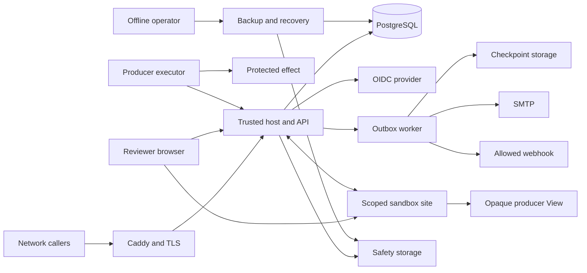

# Threat model

## Boundary

This model covers the HAIP 2 draft 3 reference implementation in this repository. It is an internal engineering artefact and does not count as independent security sign-off.

The model includes the HTTP service, browser host and sandbox, PostgreSQL state, background delivery, signed audit and recovery records, backup and restore, the TypeScript verifier and the fixed counter demonstration. It treats identity, storage, email, webhook destinations, TLS termination and an executor's protected effect as connected systems with separate administrators.

## System

The trusted host owns authentication, policy, candidate confirmation and signed state changes. The producer View receives bounded snapshots and can propose a response through a proxy, while confirmation stays in the trusted host. The executor receives authority from the API and must verify every binding before it starts an external effect.

## Assets

- Review documents, structured payloads, responses and retained private material.
- Human identity, reviewer assignment, the frozen candidate and the confirmed receipt.
- Execution purpose, proposal, context, policy, occurrence, claim, admission, deadline and outcome.
- Tenant boundaries, route policy, principal credentials and session state.
- Signing keys, backup keys, OIDC secrets, database credentials and SMTP credentials.
- Audit order, checkpoint acceptance, permanent recovery fences and retired generations.
- Service, database, identity, anchor, notification and executor availability.
- Maintained source, generated contracts, dependency pins and CI authority.

## Assumptions

- Caddy is the only normal network peer of the Node service. The application makes no security decision from forwarded client IP headers, and anonymous rate limits are service-wide.
- Production uses distinct HTTPS registrable sites for the trusted host and sandbox pattern.
- PostgreSQL is on a private path, uses verified TLS in production and grants the service only its required database authority.
- One active service process owns a namespace. Restart and activation after restore follow the offline recovery procedure.
- Runtime secrets arrive through deployment facilities with controlled access and are absent from source control and routine logs.
- Checkpoint and safety storage have administrators independent from the live service, with locked retention and legal holds configured as required.
- Configured OIDC issuers, webhook hosts, email infrastructure and public trust manifests are controlled by their named operators.
- An executor verifies signed HAIP authority and the bound proposal, context, policy, identity, occurrence, anchor and time immediately before its protected effect.
- The local directory used by the fixed counter demonstration is private to its operator.

## Attackers

| Attacker            | Capabilities                                                                                                                                                                                            |
| ------------------- | ------------------------------------------------------------------------------------------------------------------------------------------------------------------------------------------------------- |
| Anonymous client    | Can open connections, repeat public and authentication requests, choose HTTP headers and send malformed or oversized bodies within network limits.                                                      |
| Tenant principal    | Can hold a valid producer, publisher, operator or human credential for one tenant and exercise every route allowed to that role. A stolen bearer credential has the same authority until it is revoked. |
| Producer author     | Can choose review material, schemas, execution proposals and wording intended to mislead a reviewer.                                                                                                    |
| View publisher      | Can supply hostile HTML and JavaScript that runs in the opaque producer frame and sends malformed, repeated or racing messages.                                                                         |
| Reviewer            | Can confirm a harmful response deliberately or after deception, while lacking producer or operator authority unless separately provisioned.                                                             |
| Remote dependency   | Can delay, reject or return conflicting responses from identity, storage, SMTP, DNS or an allowed webhook endpoint.                                                                                     |
| Contributor         | Can propose source, dependency, workflow or generated artefact changes and attempt to hide unsafe behaviour in review noise.                                                                            |
| Privileged intruder | Host, database, identity-provider or signing-key control is outside the normal attacker baseline. The impact of that compromise is still recorded because recovery and anchoring only limit part of it. |

## Boundaries

| Boundary            | Untrusted side                     | Trusted side                          | Checks                                                                                                                                                            |
| ------------------- | ---------------------------------- | ------------------------------------- | ----------------------------------------------------------------------------------------------------------------------------------------------------------------- |
| Network edge        | Internet request bytes             | Caddy and Express                     | HTTPS, host configuration, application admission limits, authentication before protected parsing, encoding checks and body limits.                                |
| Tenant identity     | Cookie or bearer token             | Principal loaded from PostgreSQL      | Token digest lookup, issuer and subject mapping, enabled state, tenant-scoped reload and role checks.                                                             |
| Human browser       | OIDC pages and producer content    | Trusted host controls                 | PKCE, state, nonce, initiating-session binding, secure cookies, CSRF, trusted user gestures and exact candidate display.                                          |
| View sandbox        | Publisher HTML and messages        | Trusted proxy and host                | Separate site, opaque inner origin, CSP, sandbox attributes, exact source and origin checks, strict envelopes, byte limits, depth limits and one-use message IDs. |
| State store         | Concurrent and restored records    | Tenant transaction state              | Advisory lock, parameterised SQL, stored digest checks, idempotency, conditional updates, generation checks and bounded reads.                                    |
| External delivery   | Route destinations and DNS         | Outbox acceptance state               | Exact host allowlist, public-address checks, DNS pinning, HTTPS port 443, no redirects, signed delivery envelopes and retry windows.                              |
| Independent records | Live service claims                | Locked checkpoint and safety versions | Signature verification, exact canonical bytes, immutable version checks, retention, legal hold and generation retirement.                                         |
| Executor            | Network authority records          | Protected effect                      | SDK signature and binding verification, exclusive occurrence and identity claims, anchored admission and fresh dispatch checks.                                   |
| Backup              | Database and operator input        | Restored namespace                    | AES-256-GCM authentication, private files, argv without credentials, empty target, admission fence and offline recovery.                                          |
| Repository          | Contributor changes and registries | Release source                        | Exact dependency versions, generated file checks, workflow actions pinned by full commit SHA, CodeQL and human review.                                            |

## Abuse cases

| ID    | Abuse path                                                                                                                                                                      | Existing controls                                                                                                                                                                                                                                                                                                                                                                                             | Residual                                                                                                                                                                                                      |
| ----- | ------------------------------------------------------------------------------------------------------------------------------------------------------------------------------- | ------------------------------------------------------------------------------------------------------------------------------------------------------------------------------------------------------------------------------------------------------------------------------------------------------------------------------------------------------------------------------------------------------------- | ------------------------------------------------------------------------------------------------------------------------------------------------------------------------------------------------------------- |
| TM-01 | An anonymous client floods login, callback, session, health or API paths to consume identity-provider, parser or database capacity.                                             | Login and callback share a small service bucket, protected paths share a larger service bucket, health has its own bucket, API requests enter tenant and principal buckets before preflight and body parsing, parsing is bounded and protocol creation has daily, burst, outstanding and retained-data quotas.                                                                                                | In-process counters reset and do not coordinate across processes. The service-wide anonymous bucket can be consumed by one client, so the trusted edge still needs client-aware limits and capacity evidence. |
| TM-02 | An attacker fixes or swaps a login session, replays a callback, forges a state-changing browser request or uses a disabled principal.                                           | OIDC state, nonce and PKCE are bound to an expiring pending-login record and the initiating browser session. Session rotation, secure host cookies, origin-bound CSRF, token digests and principal reloads protect later requests.                                                                                                                                                                            | A compromised identity provider, browser or live bearer token retains its granted role until revocation and session cleanup.                                                                                  |
| TM-03 | A principal guesses another tenant's object identifier or submits an operation allowed to a different role.                                                                     | Authentication selects the tenant, transactions and object reads include tenant, principals are reloaded under the tenant lock, role and route policy are checked, and unavailable objects use the same absence response.                                                                                                                                                                                     | A database administrator or service signing-key holder crosses this boundary by definition.                                                                                                                   |
| TM-04 | A producer submits misleading material, changes purpose through supersession or races a different candidate into the confirmation click.                                        | Purpose is explicit and immutable across supersession, execution fields depend on execution purpose and profile, candidates are schema checked, the browser freezes one complete candidate, and confirmation checks its ID, digest and reviewer inside the tenant transaction.                                                                                                                                | A reviewer can still accept deceptive content. Native presentation, publisher provenance and the exact candidate panel reduce this human risk.                                                                |
| TM-05 | A hostile View reads host data, reaches the network, navigates, opens storage, invokes an arbitrary method, replays IDs or proposes after the reviewer has frozen a response.   | Producer code runs in an opaque frame with a policy that denies network access, behind a trusted proxy on the sandbox site that checks the outer host exactly. Message schema, size, depth, lifecycle, source and request IDs are bounded, and later proposals require dismissal plus a new trusted gesture.                                                                                                  | A browser isolation defect or persuasive visual content remains possible. The native view is the recovery path when the View fails.                                                                           |
| TM-06 | A producer replays an authorisation, substitutes an execution proposal or identity, starts after expiry, reuses an occurrence or treats review approval as execution authority. | Review and execution purposes are disjoint. Signed receipt, checkpoint, claim and admission bind the request, proposal, context, policy, occurrence, identity, namespace and deadlines. Permanent safety records retain consumption across database restore.                                                                                                                                                  | An executor that skips SDK verification can perform an unauthorised effect outside the service. Each executor needs separate integration evidence.                                                            |
| TM-07 | A live service or restored database rewrites audit history, omits a tail or reopens old authority.                                                                              | Hash-chained audit records, signed checkpoints, immutable version checks, locked retention, permanent generation and occurrence records, restore fencing and conservative recovery invalidation expose or contain these cases.                                                                                                                                                                                | Real storage policy, administrative independence and failure recovery need production acceptance. Loss of both live and independent authority can make history indeterminate.                                 |
| TM-08 | A tenant configures a webhook to probe private infrastructure or changes the destination after enqueue.                                                                         | Exact host allowlists managed by an operator, HTTPS port 443, URL credential and fragment rejection, checks that every DNS answer is public, connection pinning, no redirects, destination revision checks and signed delivery bodies constrain delivery.                                                                                                                                                     | A compromised allowed host can retain signed event data and delay responses. Treat the allowlist as an egress privilege.                                                                                      |
| TM-09 | A slow storage, webhook or SMTP endpoint holds the tenant lock and repeatedly delays state changes.                                                                             | A short transaction records a durable generation and destination revision claim, bounded network I/O runs after commit, and a fenced transaction finalises only the current claim. Five-minute leases recover abandoned work. Retry delay, delivery expiry and incident records bound subsequent attempts.                                                                                                    | A lease expiry can permit duplicate network delivery. Webhook receivers deduplicate by event ID, while SMTP retains best-effort semantics.                                                                    |
| TM-10 | Local users recover database credentials from process arguments, backup residue, URI overrides or inherited child variables.                                                    | Backup argv carries a sanitised topology URL and refuses external passfile or service selectors. The database password uses an exact mode `0600` passfile, inherited database, password, passfile and service variables are removed, TLS key password is removed from argv, child diagnostics discard stderr and the passfile directory is removed after completion. Backups are authenticated and encrypted. | Backup and TLS key material remains available to the authorised service process. Host access and operator key handling determine the remaining exposure.                                                      |
| TM-11 | A dependency or workflow change introduces malicious code or scans stale generated material instead of maintained source.                                                       | Exact dependency versions, lockfile checks, generated contract checks, workflow actions pinned by full commit SHA, minimal workflow permissions and CodeQL source exclusions make reviewed inputs explicit.                                                                                                                                                                                                   | Registry, maintainer and repository account compromise still require release review, provenance checking and rapid dependency response.                                                                       |
| TM-12 | A deployment acceptance adapter receives unrelated operator or CI credentials.                                                                                                  | The plan names every inherited adapter variable, every declared secret must appear in that allowlist, reports record inherited names, and regression tests prove an unrelated secret is withheld.                                                                                                                                                                                                             | Adapters execute with the operator's filesystem authority. Review adapter source and use a dedicated process account or isolated runner when local credentials exist.                                         |

## Priorities

1. Add limits per client at the trusted edge, then use a shared application rate store before running more than one process.
2. Run provider acceptance, recovery, credential rotation and capacity exercises with the production identities and administrative split.
3. Obtain independent review of the protocol, this implementation and the executor integration, with findings tracked separately from this internal record.
4. Test the trusted reviewer display with deceptive producer material and retain the native fallback as part of the release evidence.
